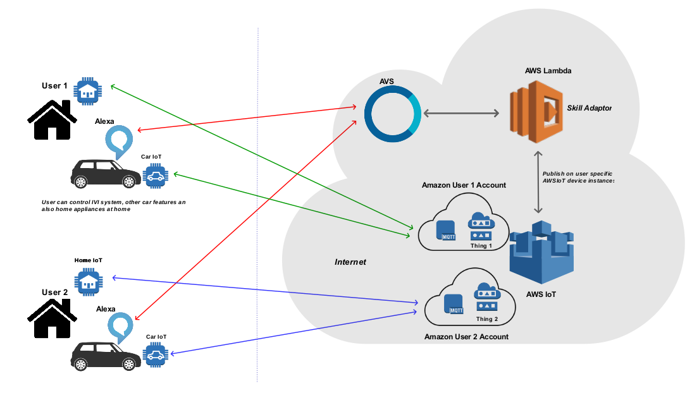

# (Unmaintained)

## Introduction 
Home and Car Automation using Alexa. 
Alexa Client running in the IVI ECU inside the car. Custom Alexa Lambda Skill installed in the AWS Lambda. AWS IoT used as MQTT Broker for the device communication.  
Skill is invoked with the skill initiation voice command. Once alexa skills activates, Alexa Cloud Server send the voice commands transcribed to text to the custom skill.  
Skill understands the text commands and publish the appropriate commands to the AWS IoT via MQTT. AWS MQTT Broker publishes the commands to the subscribed clients. Clients can be Car or some device at home running MQTT Client.

It can be extended to control more IoT devices.

Refer pdf for more information.

I no longer maintain this project. Code written works if integrated properly. 

**Update** 
This was done when Alexa was in infancy. Alexa has all grown up and the APIs which were used here may not be supported currently.

